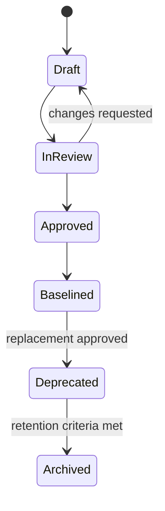

# 006 — Document Lifecycle

> **Document ID:** DOC-GOV-006  
> **Versione:** 0.96  
> **Stato:** Release Candidate  
> **Owner:** Documentation Architecture  
> **Ambito autorevole:** stati, deprecazione, archiviazione ed eliminazione.

## 1. Stati e transizioni

## 2. Deprecazione

Un documento deprecato deve indicare:

- data;
- motivo;
- CR;
- sostituto;
- eventuale finestra di compatibilità.

I link verso un documento deprecato devono essere aggiornati progressivamente verso il sostituto.

## 3. Eliminazione

L'eliminazione fisica è eccezionale e ammessa solo per:

- dati sensibili inseriti per errore;
- artefatti corrotti o duplicati senza valore storico;
- obblighi legali.

Negli altri casi si archivia. L'eliminazione richiede CR e audit del grafo dei riferimenti.

## 4. Retention

ADR, CR, baseline, manifest e audit sono conservati permanentemente. Draft intermedi possono essere rimossi dopo la baseline se la storia significativa è preservata in CR/ADR.

<!-- V0954-RC-LIFECYCLE:START -->
## 8. Release Candidate

`Release Candidate` non equivale a `Baseline`. È uno stato proposto dopo chiusura documentale e prima della review finale. Richiede:

- audit documentale completo;
- Architecture Compliance evidence;
- elenco blocker e debt residuo;
- Architectural Review del Lead Architect;
- approvazione del Product Owner.

Solo una CR successiva può promuovere la candidate a Frozen Baseline.
<!-- V0954-RC-LIFECYCLE:END -->
