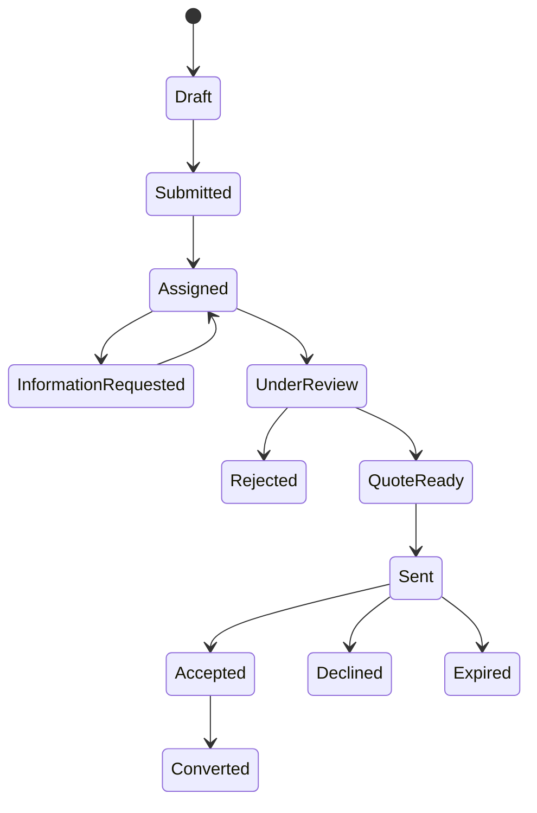
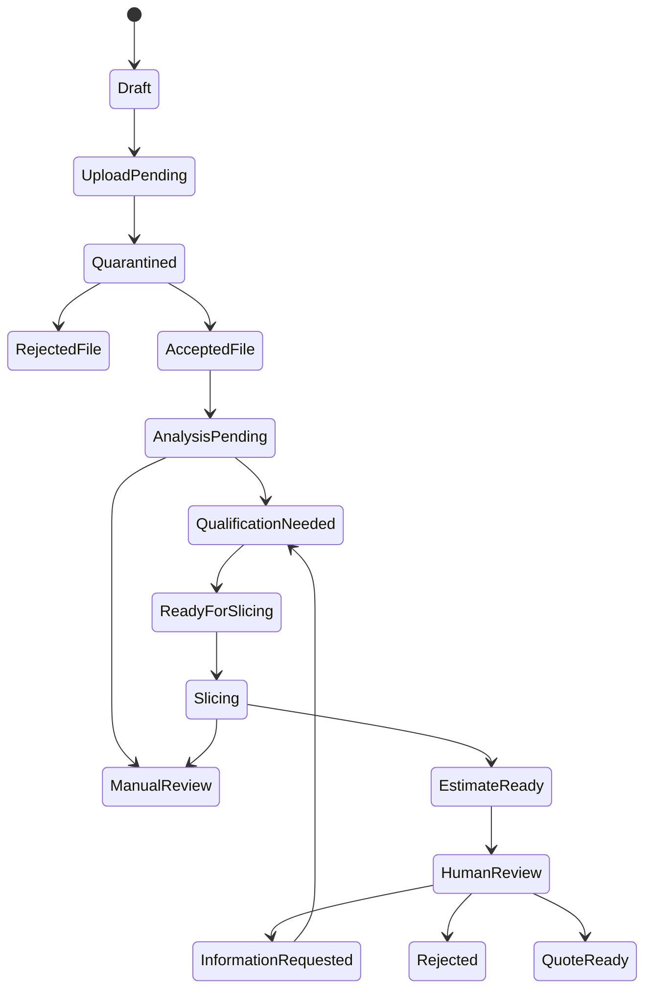
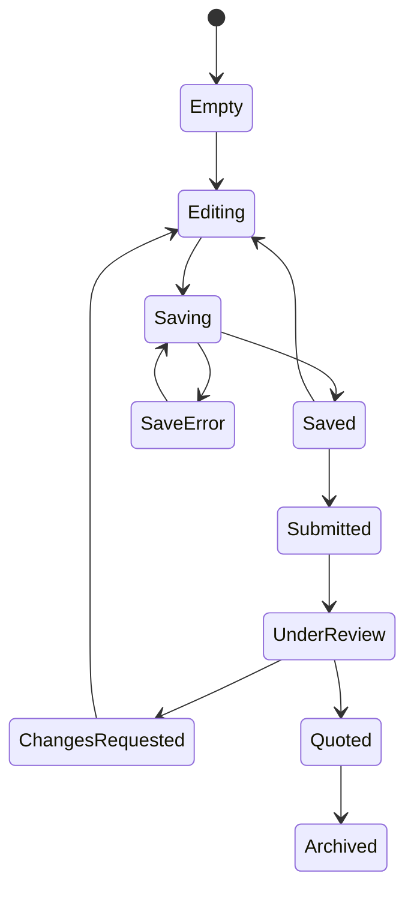
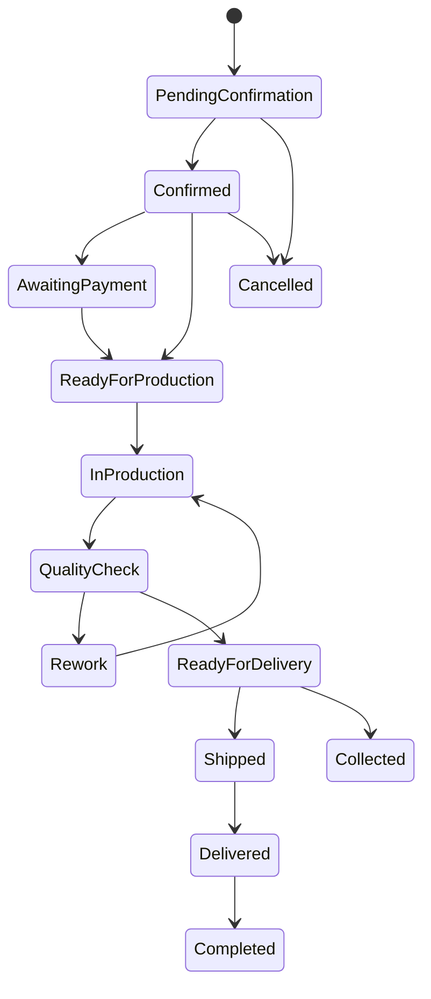
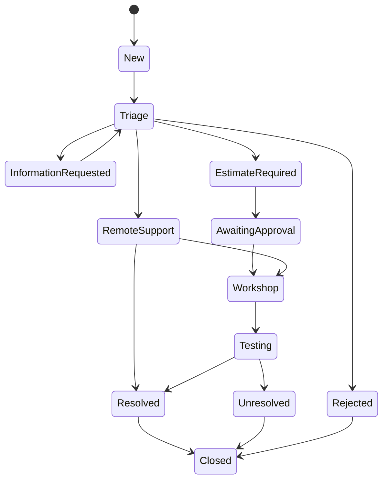
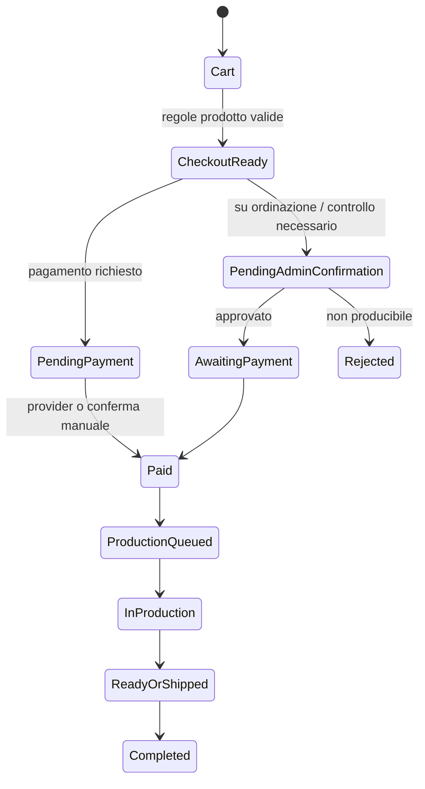
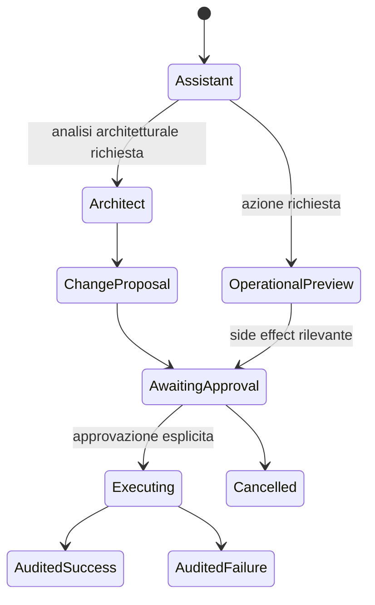

# State Machines

> **Document ID:** DOC-PROD-004  
> **Versione:** 0.95.3  
> **Stato:** In Review  
> **Owner:** Domain Architecture  
> **Ambito autorevole:** stati e transizioni degli aggregate principali.

## 1. Quote request



Guardrail: solo `QuoteReady` revisionata può diventare `Sent`; `Accepted` riferisce la versione inviata.

## 2. STL project



## 3. Lantern configuration



`Submitted` è uno snapshot; il draft può generare una revisione successiva.

## 4. Order



Pagamento, fulfillment e stato ordine possono essere sottostati separati; non dedurre pagamento da `Confirmed`.

## 5. Assistance ticket



## 6. Content

```text
Draft → In Review → Approved → Scheduled → Published → Archived
                     ↘ Rejected → Draft
Published → Revised (new revision) → In Review
```

## 7. Media asset

```text
Uploaded → Quarantined → Metadata Required → In Review → Approved → Published/Used → Archived
             ↘ Rejected
```

## 8. Event

```text
Draft → Published → Ongoing → Completed → Archived
                  ↘ Postponed → Published
                  ↘ Cancelled
```

## 9. Newsletter subscriber

```text
Pending Confirmation → Active → Unsubscribed
                    ↘ Expired
Active → Suppressed (bounce/complaint/admin)
Suppressed → Active only through authorized remediation/new consent
```

## 10. AI execution

```text
Created → Authorized → Running → Awaiting Confirmation → Running → Succeeded
                               ↘ Failed
                               ↘ Cancelled
```

Una tool call con side effect non può passare da `Awaiting Confirmation` senza confirmation record valido.

## 11. Regole trasversali

- transizioni autorizzate server-side;
- stato precedente e nuovo nell'audit;
- optimistic concurrency;
- side effect successivi via outbox;
- retry non ripete transizioni non idempotenti;
- cancellazioni preservano gli obblighi di retention.

<!-- V0952-STATES:START -->
## 12. Cart e Order Confirmation



## 13. Jarvis Execution Mode



Nessuno stato Jarvis è raggiungibile da visitatore o cliente.
<!-- V0952-STATES:END -->
