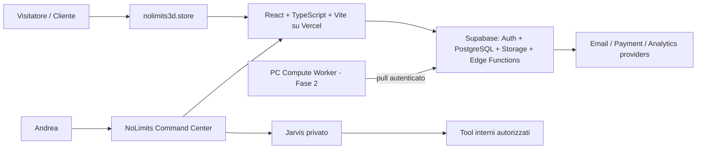
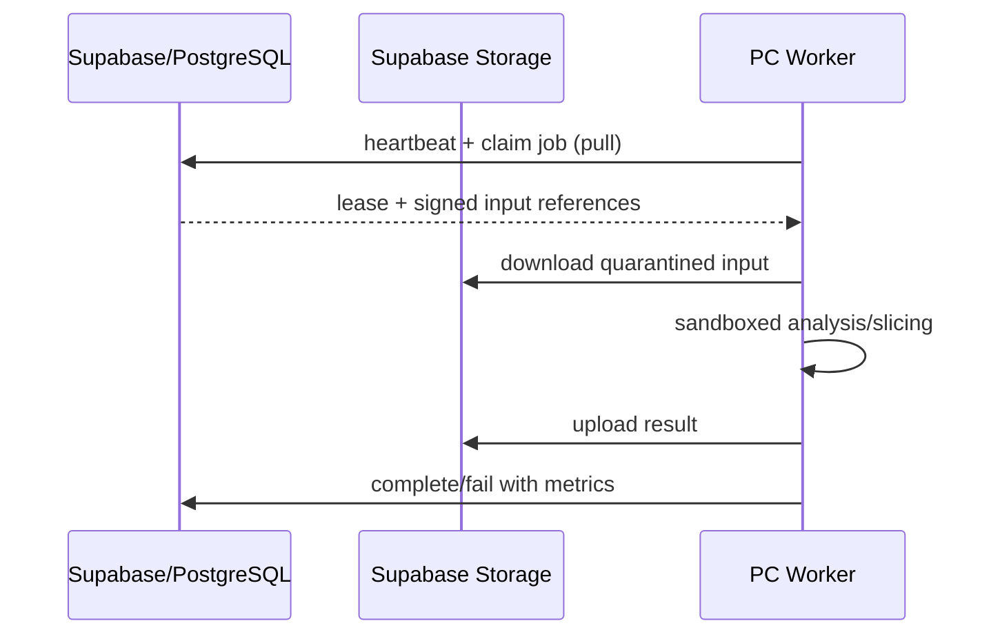

# Software Design Specification

> **Document ID:** DOC-ARCH-001  
> **Versione:** 0.95.4  
> **Stato:** In Review  
> **Owner:** Software Architecture  
> **Ambito autorevole:** architettura complessiva, contesti, container, confini e qualità.

## 1. System context

Jarvis non ha ingressi pubblici. Il PC Worker non riceve traffico pubblico e il sito non dipende dal suo uptime.

## 2. Architectural style

- modular monolith nella Fase 1;
- frontend application separata dai servizi backend tramite contratti;
- Supabase come BaaS iniziale;
- API-first e server-side authorization;
- Edge Functions per logica privilegiata, integrazioni e webhook;
- job durabili e worker pull per compute pesante;
- adapter per provider esterni e future integrazioni.

## 3. Frontend stack corrente

React, TypeScript, Vite, React Router, TanStack Query, React Hook Form, Zod, Tailwind CSS, shadcn/ui, React Three Fiber e Drei. La scelta è approvata come corrente da ADR-0018, ma la Frozen Baseline richiede un confronto formale con Next.js.

## 4. Backend stack

Supabase PostgreSQL è il system of record; Auth gestisce identità; RLS applica autorizzazione data-level; Storage conserva binari e derivative; Edge Functions gestiscono segreti, side effect, webhook, orchestrazione e funzioni non sicure nel browser. Realtime è selettivo. Nessun backend Express/NestJS in Fase 1.

## 5. Bounded modules

1. Website/Public Content;
2. Catalog;
3. Commerce;
4. Lantern Configurator;
5. Custom Requests;
6. Services;
7. Customer Account;
8. Events;
9. Newsletter;
10. Blog/Portfolio;
11. Media Library;
12. Admin Command Center;
13. Jarvis private orchestration;
14. Documentation Governance;
15. PrintFlow Integration — Fase 2;
16. STL Quoting — Fase 2.

Ogni modulo possiede modello, use case, policy e adapter. Dipendenze tra moduli passano attraverso interfacce o eventi definiti; i componenti UI non importano direttamente tabelle di moduli estranei.

## 6. Commerce architecture

Un aggregate catalog item descrive prodotto o servizio e il relativo `commercial_mode`. Cart, order, quote e payment sono aggregate distinti. Il checkout interroga policy server-side e non deduce pagabilità dal solo prezzo visualizzato.

## 7. Command Center e Jarvis

> **Jarvis è l'assistente AI strettamente privato di Andrea, integrato esclusivamente nel Command Center amministrativo di NoLimits3D. Assiste Andrea nella gestione e nell'evoluzione del sito tramite strumenti autorizzati, con identità e permessi verificati server-side e controllo umano sulle azioni consequenziali. Non è un servizio pubblico, non è un chatbot clienti e non fa parte del team di sviluppo.**

Il Command Center è una protected application area con RBAC/capability checks. La dashboard aggrega read model operativi. Jarvis sarà una capability privata con tre modalità, tool allowlist, approval records e audit. Nessun modulo pubblico importa route, prompt o secret di Jarvis.

L'implementazione non è autorizzata nell'attuale foundation. Un Blueprint Jarvis dedicato deve definire identity/capability model, `jarvis.use`, autorizzazione server-side per tool e resource scope, RLS, audit, approval matrix, privacy, threat model, negative test, fallback e kill switch prima di qualsiasi route, endpoint, prompt runtime, memoria o provider.

## 8. Compute Worker pattern

Job idempotenti, lease, retry, timeout, heartbeat, capability/version, quarantine e audit sono obbligatori prima dell’attivazione Fase 2.

## 9. Security architecture

- browser usa chiavi pubbliche e sessioni utente, mai service role;
- RLS deny-by-default;
- Edge Functions verificano sessione, capability e idempotency;
- signed URL brevi per asset privati;
- Jarvis route admin-only e defense-in-depth;
- worker con identità macchina revocabile, credenziali minime e nessuna porta pubblica;
- upload in quarantine prima della pubblicazione/elaborazione.

## 10. Quality attributes e fitness functions

- SEO e rendering pubblico verificati dal review gate;
- bundle e route budget;
- WebGL fallback;
- RLS policy tests;
- architecture tests sui confini;
- public-route scan assicura assenza Jarvis;
- PrintFlow Phase 1 guard;
- worker-offline resilience test;
- RTM e ADR link gate.

## 11. Decisioni aperte

Esito React/Vite–Next.js, brand assets, legal/privacy, consent implementation e hardening operativo finale del PC Worker. Questi punti impediscono la Frozen Baseline, non la coerenza della candidate.

<!-- V0954-COMPLIANCE-MODEL:START -->
## 18. Architecture compliance model

Ogni decisione e implementazione architetturale deve superare `ACG-00`–`ACG-11` in `000_GOVERNANCE/007_QUALITY_GATES.md`. Il design non è conforme se introduce una funzione fuori RTM, rende il sito dipendente dal worker, espone Jarvis, attiva PrintFlow in Fase 1 o elimina human review dai flussi conseguenziali.
<!-- V0954-COMPLIANCE-MODEL:END -->
