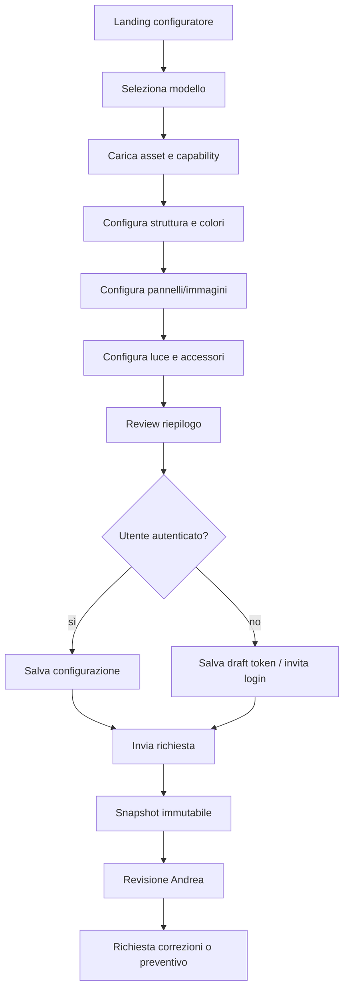

# Configuratore lanterne — Mini-specifica di prodotto

> **Document ID:** DOC-FEAT-002  
> **Versione:** 0.95.3  
> **Stato:** In Review  
> **Owner:** Product / 3D Experience  
> **Ambito autorevole:** comportamento end-to-end del configuratore lanterne.

## 1. Obiettivo

Consentire a un cliente non tecnico di scegliere un modello di lanterna, personalizzare pannelli, immagini, colori e illuminazione, visualizzare una preview attendibile, salvare il lavoro e inviarlo per revisione/preventivo.

Il configuratore non deve promettere che la preview sia una simulazione fotorealistica del risultato fisico. Deve distinguere preview visuale, fattibilità tecnica e conferma finale.

## 2. Scope per fasi

### Fase 1

- catalogo modelli e opzioni amministrabili;
- configurazione guidata;
- preview 2D/3D progressiva;
- upload/selezione immagini;
- salvataggio draft locale/server;
- invio richiesta;
- revisione Andrea;
- nessun prezzo finale automatico obbligatorio.

### Future

- prezzo dinamico;
- checkout;
- collaborazione cliente-operatore;
- nuovi modelli plug-in;
- AR preview;
- integrazione produzione/PrintFlow.

## 3. Attori

- visitatore anonimo;
- cliente autenticato;
- operatore;
- admin catalogo;
- renderer 3D;
- media pipeline;
- quote service.

## 4. Requisiti

| ID | Requisito | Pri |
|---|---|---|
| LANT-F-001 | Elencare modelli configurabili e relative capacità. | Must |
| LANT-F-002 | Applicare solo combinazioni compatibili. | Must |
| LANT-F-003 | Mostrare preview aggiornata delle selezioni. | Must |
| LANT-F-004 | Offrire fallback statico se WebGL non è disponibile. | Must |
| LANT-F-005 | Salvare e riprendere un draft. | Must |
| LANT-F-006 | Versionare modello, opzioni e configurazione inviata. | Must |
| LANT-F-007 | Gestire immagini caricate tramite Media/Upload Security. | Must |
| LANT-F-008 | Inviare la configurazione a revisione umana. | Must |
| LANT-F-009 | Tracciare funnel e problemi senza PII non necessaria. | Should |
| LANT-F-010 | Consentire aggiunta futura di modelli senza riscrivere il motore. | Must architetturale |

## 5. User flow



## 6. UX dettagliata

### Step 1 — Modello

Mostrare dimensioni, numero pannelli, esempi, compatibilità e complessità. Evitare nomi interni. Il cambio modello dopo personalizzazione richiede conferma e mostra cosa verrà perso o migrato.

### Step 2 — Struttura

Scelte di colore/materiale sono filtrate per modello. Ogni opzione può avere nota su finitura e resa reale.

### Step 3 — Pannelli

Per ogni slot:

- scegliere asset esistente;
- caricare immagine;
- crop/position non distruttivo;
- vedere safe area;
- ricevere warning su risoluzione, contrasto o dettaglio;
- duplicare una selezione su più pannelli.

### Step 4 — Luce/accessori

Selezioni ammesse dal modello: temperatura/colore, alimentazione, piedini, supporti. Le specifiche elettriche definitive appartengono al catalogo tecnico.

### Step 5 — Review

Riepilogo testuale e visuale, warning, asset, dimensioni, note e consenso di invio. L'utente può tornare a ogni step senza perdere dati.

## 7. State model

```text
empty → editing → autosaving → saved → submitted → under_review → changes_requested → quoted → archived
```

`submitted` crea snapshot. Modifiche successive producono una nuova revisione, non alterano l'invio precedente.

## 8. 3D engine

### Render model

```json
{
  "modelVersion": "lantern-cube@1.2",
  "geometry": "asset-key",
  "materials": [{"slot":"frame","token":"pla-black"}],
  "panels": [{"slot":"north","texture":"media-version-id","transform":{}}],
  "lighting": {"preset":"warm"},
  "quality": "adaptive"
}
```

Il renderer consuma questo modello e non conosce quote, cliente o stato form.

### Asset manifest

Ogni modello pubblicato dichiara:

- ID/versione;
- geometry LOD;
- bounding box e camera preset;
- material slots;
- panel UV/safe area;
- option compatibility;
- fallback images;
- minimum renderer version.

### Prestazioni

- lazy load dopo intent;
- geometry compressa;
- texture derivative dedicate;
- LOD e quality tiers;
- no shadow costose su low-end;
- frame cap adattivo;
- dispose risorse;
- memory budget e context-loss recovery.

## 9. Texture management

- crop e trasformazione salvati come parametri;
- original preservato;
- derivative texture generata in pipeline;
- color space dichiarato;
- dimensioni massime;
- UV mapping versionato;
- invalidazione cache quando asset/versione cambia;
- warning quando il modello nuovo rende incompatibile una configurazione.

## 10. Compatibility model

Le opzioni non usano condizioni hardcoded nel frontend. Il catalogo espone capability e constraint, per esempio:

```text
model supports panel_count=4
panel north accepts image|hueforge
lighting warm requires power 12V
accessory wall_mount incompatible with floor_feet
```

Il server rivalida sempre la configurazione.

## 11. Persistence

- draft anonimo con token firmato e scadenza;
- merge controllato al login;
- autosave debounced;
- version optimistic concurrency;
- snapshot su submit;
- retention coerente con privacy;
- export JSON interno per supporto e migrazione.

## 12. Dati

Entità principali:

- LanternModel;
- LanternModelVersion;
- OptionDefinition;
- CompatibilityRule;
- LanternConfiguration;
- LanternConfigurationRevision;
- LanternSelection;
- RenderAssetManifest;
- SubmittedConfigurationSnapshot.

Schema autorevole in Database Design.

## 13. API indicative

- `GET /v1/lantern-models`;
- `GET /v1/lantern-models/{id}/versions/{version}`;
- `POST /v1/lantern-configurations`;
- `PATCH /v1/lantern-configurations/{id}` con expected version;
- `POST /v1/lantern-configurations/{id}/validate`;
- `POST /v1/lantern-configurations/{id}/submit`;
- `GET /v1/lantern-configurations/{id}` autorizzato.

## 14. Error and recovery

- asset non caricato: fallback e retry;
- WebGL assente: preview statiche;
- configurazione incompatibile: indicare opzione e recovery;
- autosave fallito: preservare stato locale e bloccare submit finché non sincronizzato;
- modello aggiornato: migrazione guidata o apertura read-only della versione precedente.

## 15. Security/privacy

- signed upload e quarantena;
- accesso configurazioni per owner/operator;
- token anonimi ad alta entropia;
- nessun URL pubblico permanente per original privati;
- sanitizzazione note;
- audit submit/review;
- diritto e consenso per immagini di persone quando applicabile.

## 16. Analytics

- configurator_started;
- model_selected;
- step_completed;
- asset_uploaded;
- warning_shown;
- fallback_3d_used;
- draft_saved;
- configuration_submitted;
- review_outcome.

## 17. Acceptance criteria

- una configurazione valida è riproducibile dallo snapshot;
- combinazioni incompatibili sono impedite client e server;
- il flusso funziona senza WebGL;
- autosave e resume non perdono selezioni;
- il cambio versione modello non altera invii storici;
- submit produce audit e richiesta operativa;
- test mobile, tastiera e reduced motion superati.

## Premium interaction policy

La preview reagisce alle scelte con motion di causalità breve e interrompibile. Nessuna animazione impedisce il confronto tra opzioni. Stato di salvataggio, compatibilità, qualità preview e differenza tra render/prodotto reale sono sempre visibili. La modalità 2D/static rimane funzionalmente completa per selezione, riepilogo e invio.

<!-- V0952-LANTERN:START -->
## Integrazione commerce v0.95.2

La configurazione valida produce una `configuration_ref` riutilizzata dal cart/order; non duplica immagini o texture. Il commercial mode è `Configurabile`. Le configurazioni che richiedono verifica diventano `pending_admin_confirmation`. Il pagamento è abilitato solo dopo validazione e, quando prevista, approvazione Andrea.
<!-- V0952-LANTERN:END -->

<!-- V0953-LANTERN-CX:START -->
## Percorsi Home e HueForge

La Home distingue lanterna catalogo e lanterna personale. Il percorso personale spiega upload 1–4 foto, analisi, anteprima con SLA candidato massimo 48 ore da validare, revisione, preventivo e pagamento. HueForge viene descritto come linguaggio artistico, non solo texture tecnica.
<!-- V0953-LANTERN-CX:END -->
