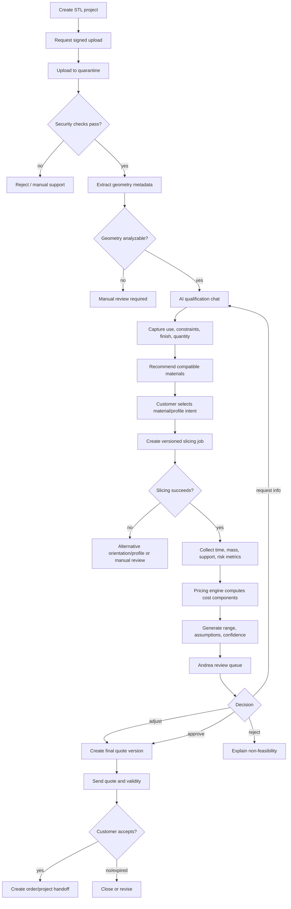

# Preventivatore STL — Workflow orchestrato

> **Document ID:** DOC-FEAT-003  
> **Versione:** 0.95.4  
> **Stato:** In Review  
> **Owner:** Product / Quotation Domain  
> **Ambito autorevole:** flusso end-to-end del preventivatore STL e contratti tra i suoi moduli.

## 1. Principio

Il sistema deve produrre una **stima assistita e revisionabile**, non un prezzo finale incontrollato. Il risultato automatico è un range con assunzioni e confidence; Andrea approva o modifica il preventivo finale.

## 2. Moduli

```text
Upload
↓
Security & File Validation
↓
STL Geometry Analysis
↓
AI Qualification Chat
↓
Material Selection
↓
Print Profile Selection
↓
Slicer Job
↓
Cost Calculation
↓
Estimated Range + Confidence
↓
Andrea Review
↓
Final Quote Version
```

Le specifiche dettagliate di Chat, Slicer, Pricing e Revision restano nei documenti 04–07; questo file possiede l'orchestrazione.

## 3. Diagramma completo



## 4. Requirements

| ID | Requisito | Pri |
|---|---|---|
| STL-F-001 | Creare un progetto e upload sicuro. | Must |
| STL-F-002 | Conservare originale e checksum. | Must |
| STL-F-003 | Estrarre metriche geometriche e warning. | Must future/MVP F2 |
| STL-F-004 | Raccogliere requisiti d'uso con chat/form. | Must |
| STL-F-005 | Limitare materiali/profili a opzioni compatibili. | Must |
| STL-F-006 | Eseguire slicing versionato e riproducibile. | Must future/MVP F2 |
| STL-F-007 | Calcolare cost components trasparenti. | Must future/MVP F2 |
| STL-F-008 | Mostrare range e confidence, non prezzo definitivo. | Must |
| STL-F-009 | Richiedere revisione Andrea prima del preventivo finale. | Must |
| STL-F-010 | Versionare ogni preventivo inviato. | Must |
| STL-F-011 | Consentire fallback manuale in ogni step automatico. | Must |
| STL-F-012 | Tracciare tool/profile/model provenance. | Must |

## 5. State machine

```text
draft
→ upload_pending
→ quarantined
→ file_accepted
→ analysis_pending
→ qualification_needed
→ ready_for_slicing
→ slicing
→ estimate_ready
→ human_review
→ information_requested | rejected | quote_ready
→ quote_sent
→ accepted | expired | declined
```

Transizioni non valide sono rifiutate server-side e auditate.

## 6. Data contract tra moduli

### Geometry analysis output

- dimensions;
- volume;
- surface area;
- triangle count;
- watertight/manifold indicators;
- shells;
- thin-wall candidates;
- orientation hints;
- warnings;
- analyzer/version;
- confidence.

### Qualification output

- intended use;
- mechanical/environmental constraints;
- visual priority;
- quantity;
- deadline;
- preferred material/color;
- post-processing;
- tolerance;
- missing answers;
- provenance.

### Slicing output

- profile/version;
- orientation;
- layer height/nozzle;
- material mass;
- support mass;
- print time;
- tool changes;
- machine class;
- warnings;
- artifact references.

### Pricing input

Solo output validati e versionati. Il pricing non legge testo libero non strutturato senza normalizzazione e review.

## 7. Confidence model

Il range include confidence derivata da:

- qualità file;
- completezza brief;
- compatibilità profilo;
- successo slicing;
- esperienza su materiale/macchina;
- post-processing;
- quantità;
- rischio geometrico.

Bassa confidence forza review e impedisce comunicazioni che sembrino definitive.

## 8. Human review console

Andrea deve vedere:

- preview e file metadata;
- conversazione sintetizzata con link ai messaggi;
- warning;
- material/profile;
- slicing metrics;
- cost breakdown;
- range suggerito;
- storico modifiche;
- motivazione dell'override;
- azioni approve, adjust, request info, reject.

## 9. Idempotency and recovery

- upload retry senza creare progetti duplicati;
- analysis/slicing job idempotenti per input hash + profile version;
- result immutable;
- resume da ultimo stato valido;
- provider/tool failure non cancella il progetto;
- dead-letter visibile in admin;
- manual override sempre auditable.

## 10. Security

- file quarantine;
- size/complexity limits;
- decompression/archive policy;
- sandbox per analyzer/slicer;
- resource quotas;
- no execution di contenuto embedded;
- signed URLs con scadenza;
- PII separata dai file tecnici;
- prompt injection defense sui filename/metadata e messaggi.

## 11. Fase 1 vs Fase 2

### Fase 1

Modulo di richiesta guidata, upload sicuro e revisione manuale. Analisi/slicer/pricing possono essere mock, disabilitati o strumenti interni non vincolanti.

### Fase 2

Pipeline automatizzata progressiva, sempre con human review finché eval e dati non autorizzano un diverso livello.

## 12. Acceptance criteria

- ogni preventivo finale riferisce una versione immutabile degli input;
- range automatico e prezzo finale sono distinguibili;
- tool failure produce percorso manuale;
- nessun file passa dalla quarantena senza controlli;
- ogni override registra autore e ragione;
- il cliente riceve assunzioni e validità;
- accettazione crea handoff idempotente.

<!-- V0954-STL-HUMAN-REVIEW:START -->
## 14. Human-review invariant

`INV-004` rende impossibile lo stato `Final Quote` senza:

- identità del reviewer umano;
- timestamp e versione dei dati esaminati;
- accettazione o modifica del range automatico;
- motivazione per override rilevanti;
- audit event immutabile.

AI, slicer e pricing engine producono supporto decisionale; non possiedono autorità commerciale finale.
<!-- V0954-STL-HUMAN-REVIEW:END -->
