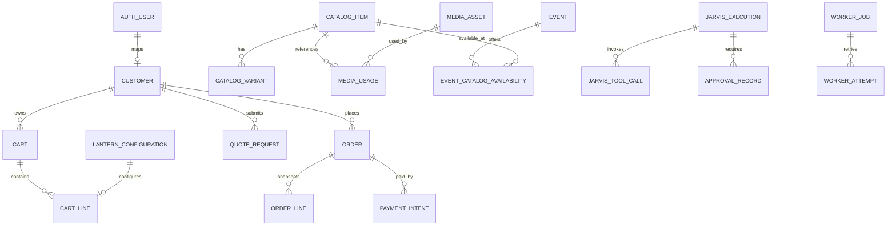

# Database Design — Supabase PostgreSQL

> **Document ID:** DOC-DATA-001  
> **Versione:** 0.95.3  
> **Stato:** In Review  
> **Owner:** Data Architecture  
> **Ambito autorevole:** schema logico/fisico, cardinalità, vincoli, RLS e migrazione dati.

## 1. Platform

PostgreSQL in Supabase è il system of record. Binari in Supabase Storage; DB conserva metadata, relazioni, checksum e policy. JSONB è limitato a snapshot/versioned configuration con schema version.

## 2. Core ER

## 3. Key tables

`profiles`, `customers`, `roles`, `capabilities`, `role_capabilities`, `catalog_items`, `catalog_variants`, `prices`, `inventory`, `carts`, `cart_lines`, `orders`, `order_lines`, `payment_intents`, `quote_requests`, `lantern_configurations`, `media_assets`, `media_derivatives`, `media_usages`, `events`, `event_catalog_availability`, `newsletter_subscriptions`, `content_items`, `audit_events`, `jarvis_executions`, `jarvis_tool_calls`, `approval_records`, `worker_jobs`, `worker_attempts`, `outbox_events` (se ADR-0006 accettato).

## 4. Cardinality/invariants

- catalog item 1:N variants;
- media asset N:M entities through usage;
- order line contains immutable commercial snapshot;
- payment intent N:1 order and independent state;
- Jarvis execution belongs only to authorized admin identity;
- worker job has at most one active lease;
- no public select on private originals, Jarvis or worker tables.

## 5. RLS matrix

Public: published catalog/content/media derivative. Customer: own profile/cart/order/request/configuration. Admin: capability-scoped access. Jarvis: no direct universal DB access; tool functions use scoped service operations. Worker: job/storage access limited to claimed jobs and short-lived references.

## 6. Migration/versioning

SQL migrations in repository, forward-only in shared environments, review and rollback/repair plan, seed reference data separate, generated types in CI, policy tests per migration. Destructive changes require expansion/migration/contraction.

## 7. Requisiti

| ID | Requisito |
|---|---|
| DATA-NF-001 | PostgreSQL Supabase deve essere il system of record e Storage deve contenere i binari. |
| DATA-NF-002 | Ogni tabella sensibile deve avere RLS esplicita e testata. |
| DATA-NF-003 | Catalog, order, payment, media, Jarvis e worker devono avere aggregate e audit separati. |
| DATA-NF-004 | Migrazioni e policy devono essere versionate e applicate via CI/CD. |
| DATA-NF-005 | Nessuna policy pubblica deve consentire accesso a Jarvis, private media o worker jobs. |
